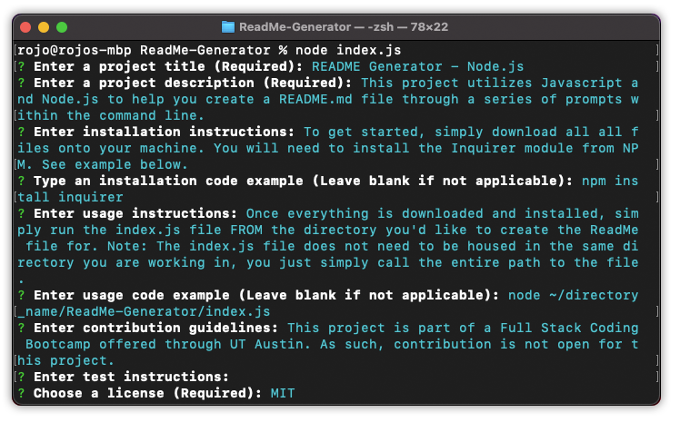

# :rocket: README Generator - Node.js

## :zap: Description
This project utilizes Javascript and Node.js to help you create a README.md file through a series of prompts within the command line.
##  Table of Contents
* [Installation](#Installation)
* [Usage](#Usage)
* [Contribution](#Contribution)
* [License](#License)
* [Contact Info](#Questions?)

## :zap: Installation
To get started, simply download all all files onto your machine. You will need to install the Inquirer module from NPM. See example below.
> npm install inquirer 

## :zap: Usage
Once everything is downloaded and installed, simply run the index.js file FROM the directory you'd like to create the ReadMe file for. Note: The index.js file does not need to be housed in the same directory you are working in, you just simply call the entire path to the file.
> node ~/directory_name/ReadMe-Generator/index.js 

## :zap: Contribution
This project is part of a Full Stack Coding Bootcamp offered through UT Austin. As such, contribution is not open for this project.
## :zap: License
This project is covered under the license: MIT
## :zap: Questions?

 [GitHub Profile](https://github.com/RojoRevolution)

Get in touch at rojorevolution@gmail.com for any additional questions